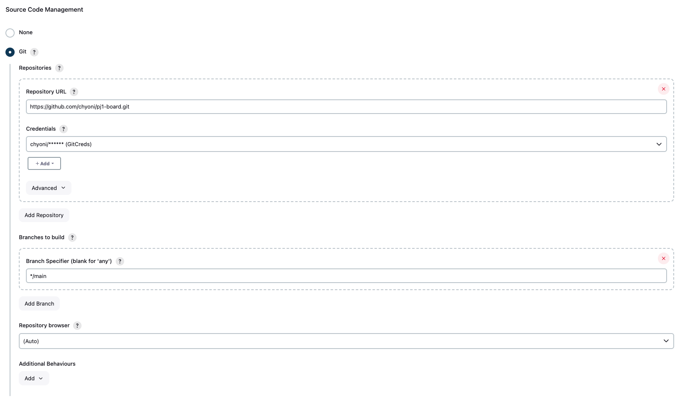
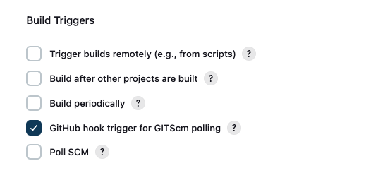

# Jenkins 연동

## 🫙 젠킨스 컨테이너 실행

```bash

docker run -d --name pj1-board-jenkins -p 8081:8080 -p 50000:50000 -v jenkins_home:/var/jenkins_home jenkins/jenkins:lts
```

---

## ⚙️ 젠킨스 설정

### 1️⃣ http://localhost:8081 접속

- 접속하면 최초에는 Admin Password 입력하라는 화면이 보인다.
- 해당 패스워드는 컨테이너 내부에 알려준 경로를 그대로 들어가서 확인하면 된다.

```bash

docker exec -it pj1-board-jenkins

cat /var/jenkins_home/secrets/initialAdminPassword
```

- 그 다음, 젠킨스에서 추천하는 플러그인을 설치하는 버튼 클릭하면 필요 플러그인들이 잘 설치되고 젠킨스 사용 가능
- GitHub Plugin, Git Plugin, Pipeline Plugin 이 세개는 반드시 설치되어 있어야 함.

### 2️⃣ Item 생성


### 3️⃣ Item - Configure - General


### 4️⃣ Item - Configure - Source Code Management



- Credentials 같은 경우엔, Github -> Settings -> Developer Settings -> Personal access tokens 에서 토큰 발급
- Jenkins [Username with password] 타입으로 Username : Github ID, Password : 위에서 발급받은 토큰

### 5️⃣ Item - Configure - Build Triggers



---

## ⚙️ Github Webhook 설정

### 1️⃣ ngrok 설치 및 실행 

- 우선, 개발용이고 Jenkins 또한 컨테이너로 로컬에 띄워져 있으니 Github 에서 외부 접근이 불가능하므로 ngrok 사용해서 외부에서 접근 가능하도록 새 URL 생성

```bash

brew install ngrok

```

- 이제는 ngrok 계정이 무조건 있어야 하고 무료 플랜 계정도 이 과정 테스트하기엔 충분하다.
- https://dashboard.ngrok.com/signup 여기서 계정 생성 후,
- 가이드에서 보여주는 대로 auth token 을 지정하면 된다.


```bash

# 8081은 내가 Jenkins 띄운 포트번호
ngrok http 8081 
```

---

### 2️⃣ Github Webhook 

- Jenkins 연동하려는 레포지토리 - Settings - Webhooks - Add webhook

| 항목           | 값                                                      |
|--------------|--------------------------------------------------------|
| Payload URL  | http://<your-jenkins-url>/github-webhook/              |
| Content type | application/json                                       |
| Secret       | 비워도 됨 (보안 필요시 설정)                                      |
| Events       | Just the push event (→ 또는 Let me select에서 Pushes 만 체크) |

	
	
	
	