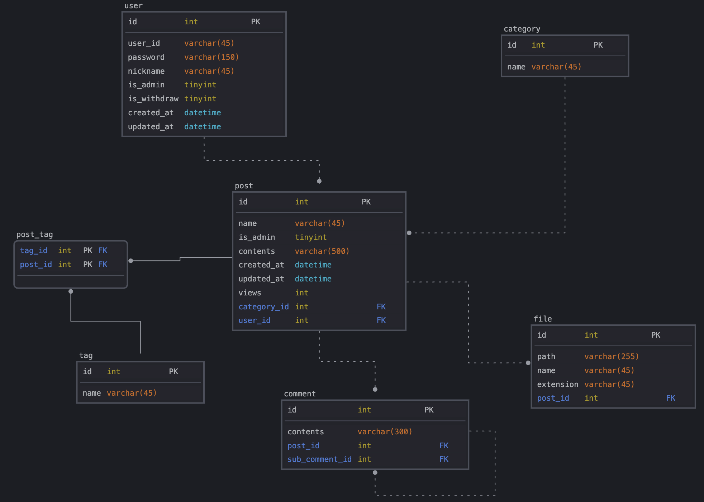

# PJ1. 게시판

대규모 트래픽 처리 연구 프로젝트 By.최치원

---

## 📌 프로젝트 목적

- 대용량 트래픽을 고려한 애플리케이션 개발 (초당 1000 TPS 이상의 게시글 검색 API)
- 객체지향과 디자인 패턴을 적용 및 가독성을 고려한 코드 작성 방법 공부
- 현업 단계의 코드 리뷰 문화 공부
- JPA, Spring Data JPA 에만 익숙한 나에게 Mybatis 경험시키기
- 모니터링 및 트러블 슈팅 전략 공부
- Jenkins 배포 자동화를 통해 개발 생산성 높이기

---

## 🧰 기술 스택

| 항목     | 내용                                                                             |
|--------|--------------------------------------------------------------------------------|
| 언어     | Java 21                                                                        |
| 빌드 도구  | Gradle                                                                         |
| 개발     | Spring Boot 3.4.4, Mybatis 3.5.14, Docker (MySQL, Redis, TestContainer 컨테이너 용) |
| 데이터    | MySQL 8.0.38, Redis                                                            |
| 성능 테스트 | Python Locust                                                                  |

---

## 📈 주요 기능

| 컴포넌트    | 기능 항목                   | 상태 |
|---------|-------------------------|----|
| **회원**  | 가입, 탈퇴                  | ✅  |
|         | 아이디 및 닉네임 중복체크          | ✅  |
|         | 비밀번호 암호화                | ✅  |
|         | 로그인, 로그아웃               | ✅  |
| **게시판** | 카테고리 관리                 | ✅  |
|         | 추가, 삭제, 수정              | ✅  |
|         | 게시글 관리                  | ✅  |
|         | 게시글 & 파일 추가, 삭제, 수정, 조회 | ✅  |
|         | 유저 정보, 게시글 제목, 게시글 내용   | ✅  |
|         | 게시글 검색 기능               | ✅  |
|         | 작성 유저 아이디 확인            | ✅  |
|         | 게시글 제목, 게시글 내용 등을 통해 검색 | ✅  |
|         | 태그 작성 및 조회 기능           | ✅  |
|         | 댓글 작성 기능                | ✅  |
| **관리자** | 공지 글 추가 기능              |    |

## 🗼 ERD

