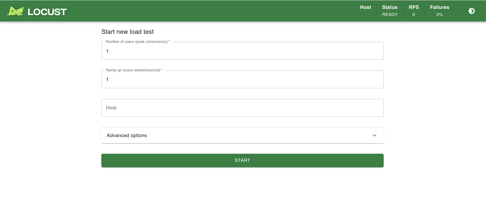

# Locust 성능 테스트

## 🚀 실행하기

### 1️⃣ 사전 준비 단계
- 성능 테스트를 위한 xxx.py 코드를 이 경로 안에서 작성한다.
- 다음 명령어로 도커를 사용하여, locust 실행
```bash

docker run --name pj1-board-locust -dp 8089:8089 -v $(pwd):/mnt locustio/locust -f /mnt/add-posts.py
docker run --name pj1-board-locust -dp 8089:8089 -v $(pwd):/mnt locustio/locust -f /mnt/add-users.py
docker run --name pj1-board-locust -dp 8089:8089 -v $(pwd):/mnt locustio/locust -f /mnt/board.py
```

- `$(pwd):/mnt` : 현재 경로의 파일들을 컨테이너의 /mnt 경로로 복사
- `locustio/locust` : 오피셜 이미지 명
- `-f /mnt/add-posts.py`: 컨테이너의 /mnt/add-posts.py 파일을 실행하여 Locust 실행
- 여기서, `add-posts.py` 는 내가 `$(pwd)` 경로에 만든 파일

### 2️⃣ http://localhost:8089 접속

- 위 흐름대로 진행이 다 되면, 도커 컨테이너가 띄워지고 웹으로 접속할 수 있다.
- 접속하면 다음과 같은 화면이 보인다.
  


- 위 화면에서, 다음과 같이 작성한다.
```bash

[USER] 유저 수
[Ramp up] 초당 늘어나는 유저 수 
# 예를 들어, 유저수 500, Ramp up을 50으로 설정하면 500명의 유저로 테스트를 할건데, 한꺼번에 확 보내지말고 초당 50명씩 천천히 늘려달라는 의미
[HOST] http://host.docker.internal:8080
```
- 이렇게 작성하는 이유는 컨테이너에서는 localhost:8080 이라고 접속해봐야 내 로컬에 있는 스프링 부트로 요청을 날리지 못하기 때문.
- `host.docker.internal`가 호스트 머신을 의미한다. (macOS 기준) 
- [Start] 버튼 클릭

---

### ☑️ 체크 항목

| 항목  | 내용                                                |
|-----|---------------------------------------------------|
| RPS | Requests Per Second (1초 동안 서버가 처리한 HTTP 요청 수)     |
| TPS | Transactions Per Second (1초 동안 처리된 '비즈니스 트랜잭션' 수) |

- 단순 요청을 초당 얼마나 서버가 처리할 수 있는지는 RPS 체크
- 하나의 흐름 (예: `로그인 -> 게시글 작성 -> 게시글 조회`)을 트랜잭션 단위로 보고 해당 트랜잭션을 초당 얼마나 서버가 처리할 수 있는지는 TPS로 체크

